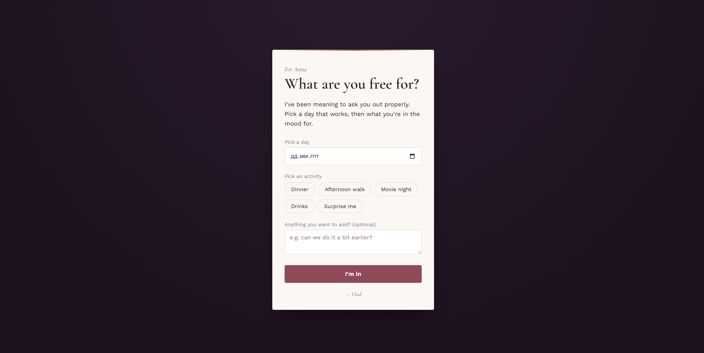

# For-her

A simple responsive Flask + uv website where your girlfriend can choose a date.



## Prerequisites
Before you begin, ensure you have the following installed on your system:
- [**python 3.13**](https://www.python.org/downloads/)
- [**uv**](https://github.com/astral-sh/uv#installation)
- [**git**](https://git-scm.com/install/)

## How to run
1. Clone the repo.
```
git clone https://github.com/Ulad/for-her.git
cd for-her
```
2. Navigate to the source directory, all application code lives inside `src/`.
```
cd src
```
3. Run the Flask development server via `uv`. This guarantees your app uses the right environment.
```
uv run flask run
```
> [!TIP]
That's it! You can use `--debug` flag to enable auto-reload on code changes, and `--port=5000` to change default port.
